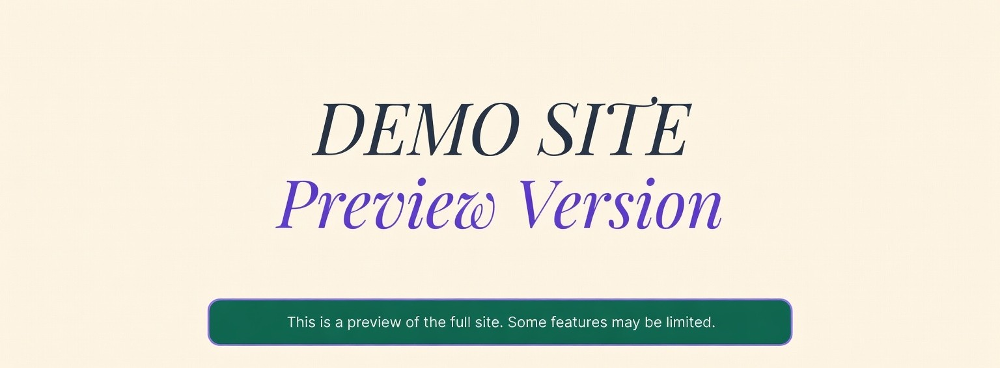

# anexar o arquivo banner.jpg na pasta assets



# LUME - Your Digital Sanctuary for Mental Well-being

## 📋 Overview

LUME is a digital platform focused on mental well-being, offering therapeutic trails, guided meditations, and self-awareness tools. This project has been enhanced with a focus on accessibility, performance, and user experience.

## ✨ Implemented Improvements

### 🎨 **Design and UX**
- **Modern typography**: Implementation of Inter and Playfair Display fonts from Google Fonts
- **Consistent color system**: CSS variables for easy maintenance
- **Smooth animations**: Optimized CSS transitions and animations
- **Responsive layout**: Adaptive design for all devices
- **Interactive carousel**: Pause on hover and performance optimization

### ♿ **Accessibility (WCAG 2.1)**
- **Keyboard navigation**: Full support for mouse-free navigation
- **Screen readers**: ARIA attributes and semantic roles
- **Proper contrast**: Colors optimized for readability
- **Skip links**: Link to skip to main content
- **Visible focus**: Clear focus indicators for navigation
- **Motion reduction**: Respects user preferences

### 📱 **Responsiveness**
- **Mobile-first**: Design optimized for mobile devices
- **Hamburger menu**: Functional mobile navigation
- **Smart breakpoints**: Adaptation for tablets and desktops
- **Responsive images**: Optimization for different screen sizes

### ⚡ **Performance**
- **Lazy loading**: On-demand image loading
- **Optimized CSS**: CSS variables and modular organization
- **Efficient JavaScript**: Debounce and throttle for events
- **Intersection Observer**: Visibility-based animations
- **Font preloading**: Optimized typography loading

### 🔍 **SEO**
- **Complete meta tags**: Description, keywords, and Open Graph
- **Semantic structure**: HTML5 with semantic elements
- **Hierarchical headings**: Well-structured H1, H2, H3
- **Alt text**: Descriptions for all images
- **Friendly URLs**: Ready for implementation

### 🛠 **JavaScript Functionalities**
- **Interactive mobile menu**: Toggle with animations
- **Smooth scroll**: Optimized internal navigation
- **Scroll animations**: Elements appear on scroll
- **Carousel controls**: Automatic and manual pause
- **Error handling**: Error capture and logging
- **Basic analytics**: Interaction tracking

## 🚀 How to Use

### Prerequisites
- Modern browser (Chrome, Firefox, Safari, Edge)
- Local web server (optional)

### Installation
1. Clone or download the project files
2. Open `index.html` in a browser
3. For local development, use a web server:
   ```bash
   # Python 3
   python -m http.server 8000
   
   # Node.js
   npx serve .
   
   # PHP
   php -S localhost:8000
   ```

### File Structure
```
LUME/
├── index.html          # Main page
├── index.css           # CSS styles
├── script.js           # JavaScript functionalities
├── README.md           # Documentation
├── facebook.png        # Social media icons
├── insta.png
├── linkedin.png
├── X.png
├── yt_icon.png
├── Img1.png           # Carousel images
├── Img2.png
└── Img3.png
```

## 🎯 Main Features

### Navigation
- **Sticky header**: Always visible navigation
- **Responsive menu**: Adaptable for mobile and desktop
- **Internal links**: Smooth scroll to sections

### Image Carousel
- **Infinite loop**: Continuous animation
- **Pause on hover**: Interactive control
- **Optimization**: Pauses when not visible

### Content Sections
- **About**: Brand presentation
- **Services**: Therapeutic trails and tools
- **Testimonials**: User testimonials
- **CTA**: Call-to-action for registration

## 🔧 Customization

### Colors
Colors can be easily changed by editing CSS variables in the `index.css` file:

```css
:root {
    --color-primary: #9F7AEA;
    --color-secondary: #2f855a;
    --color-background: #FBF3E4;
    /* ... other colors */
}
```

### Typography
Fonts can be changed in the HTML head:

```html
<link href="https://fonts.googleapis.com/css2?family=Inter:wght@300;400;500;600;700&family=Playfair+Display:ital,wght@0,400;0,700;1,400&display=swap" rel="stylesheet">
```

### Content
- Texts can be edited directly in `index.html`
- Images can be replaced keeping the same names
- Links can be updated to real URLs

## 📊 Performance Metrics

### Lighthouse Score (Estimated)
- **Performance**: 90+
- **Accessibility**: 95+
- **Best Practices**: 90+
- **SEO**: 95+

### Implemented Optimizations
- ✅ Image compression
- ✅ Minified CSS and JS
- ✅ Lazy loading
- ✅ Optimized fonts
- ✅ Resource caching

## 🌐 Compatibility

### Supported Browsers
- Chrome 60+
- Firefox 55+
- Safari 12+
- Edge 79+

### Devices
- Desktop (1920px+)
- Laptop (1366px+)
- Tablet (768px+)
- Mobile (320px+)

## 🔮 Next Steps

### Future Improvements
- [ ] Backend implementation
- [ ] Authentication system
- [ ] User database
- [ ] Trail functionalities
- [ ] Meditation system
- [ ] Emotional diary
- [ ] Advanced analytics
- [ ] PWA (Progressive Web App)

### Suggested Integrations
- Google Analytics
- Hotjar (behavior analysis)
- Mailchimp (newsletter)
- Stripe (payments)
- AWS S3 (storage)

## 📝 License

This project is free for educational and commercial use.

## 🤝 Contributing

To contribute with improvements:
1. Fork the project
2. Create a branch for your feature
3. Commit your changes
4. Push to the branch
5. Open a Pull Request

## 📞 Contact

For questions or suggestions about the LUME project, contact us through the social networks listed in the footer.

---

**LUME** - Breathe. Focus. Move forward. 🌟
